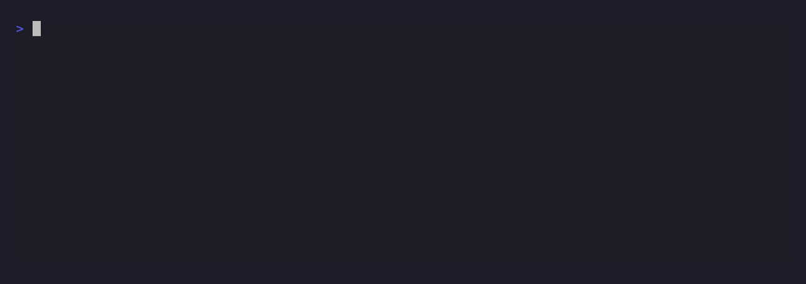

# chromeshot

A tiny, dependency-free CLI that turns local or remote web pages into
**full-page** screenshots using headless Chrome. It measures each page and
captures the entire scroll height automatically — no guessing at a
`--window-size` and no truncated tall pages.



```
capture                    # screenshot every page in ./capture.toml
capture display learn      # only the named pages
capture --list             # show configured pages, capture nothing
capture --url https://example.com -n example   # one-off, no config file
```

```
evidence_pack   1440x3265  ->  /tmp/mask_atlas_evidence_pack_1440x3265.png  (1583 KB)
```

## Why

- **True full-page capture** via the DevTools Protocol
  (`Page.captureScreenshot { captureBeyondViewport: true }`) — height is
  detected from the page, not supplied by hand.
- **Retina-sharp** output through `deviceScaleFactor` (default 2×).
- **Batch** rendering: one Chrome launch handles every page in a config.
- **No dependencies.** Pure Python standard library — no Puppeteer, no Node,
  no `pip install`. One file you can drop on your `PATH`.

## Requirements

- Python **3.11+** (uses the standard-library `tomllib`).
- Google Chrome, Chromium, or Microsoft Edge. `chromeshot` auto-detects a
  binary on macOS, Linux and Windows; override with the `CHROME_BIN`
  environment variable if needed.

## Install

```sh
git clone https://github.com/JKeatingMU/chromeshot.git
install -m 755 chromeshot/capture ~/bin/capture   # or anywhere on your PATH
```

Or just copy the single `capture` script wherever you like and make it
executable (`chmod +x capture`).

## Usage

```
capture [names...]          capture all pages, or only the named ones
  -c, --config PATH         config file (default: ./capture.toml)
      --url URL             ad-hoc page, no config file needed
  -n, --name NAME           name for the ad-hoc page
      --width N             viewport width in CSS px
      --height N            pin height (implies --no-full-page for --url)
      --full-page / --no-full-page
      --scale N             device scale factor (2 = retina)
      --wait SPEC           load | networkidle | delay:800 | selector:#ready
      --out-dir PATH        output directory
      --format FMT          png | jpeg | pdf
      --list                list configured pages and exit
      --open                open each result after writing it
      --version             print version and exit
```

Each capture is verified (file exists, non-zero) and the process exits
non-zero if any page fails, so it drops cleanly into a pre-commit hook or CI
step.

## Config: `capture.toml`

Keep one `capture.toml` per project. A `[defaults]` table sets shared options;
each `[[page]]` names a page and may override any default.

```toml
[defaults]
width         = 1440
full_page     = true                 # auto-detect height
out_dir       = "/tmp"
device_scale  = 2                     # retina-sharp
format        = "png"                 # png | jpeg | pdf
wait          = "load"                # load | networkidle | delay:800 | selector:#ready
name_template = "{name}_{width}x{height}"

[[page]]
name = "home"
url  = "https://example.com"

[[page]]
name       = "dashboard"
url         = "file:///path/to/dashboard.html"
full_page  = false                   # pin a fixed height (see note below)
height     = 1800
```

**Precedence** for any option: command-line flag > per-page value >
`[defaults]` > built-in default.

### When to pin height instead of auto-detecting

Auto-detect measures a page's scroll height, so it only works for content that
**flows**. A page laid out in viewport units (e.g. `height: 100vh`) is designed
to be exactly one screen tall and will collapse to whatever viewport height it
is given — a misleading measurement. For those pages set `full_page = false`
and pin an explicit `height`.

## Licence

MIT — see [LICENSE](LICENSE).
